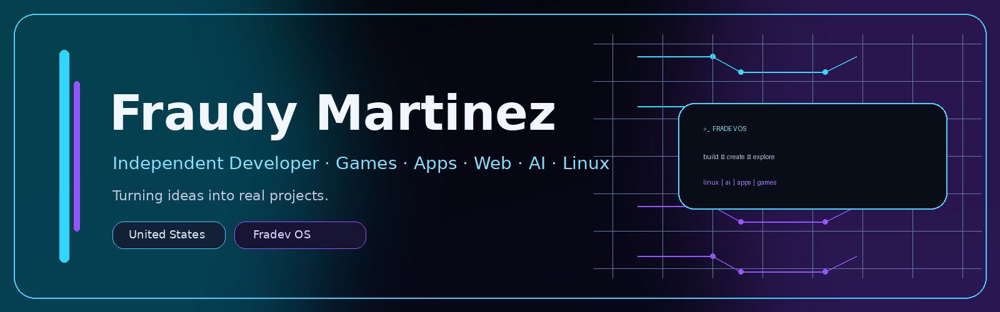

  

  
  

## Sobre mí / About me

**ES** — Desarrollador independiente que convierte ideas propias en juegos, aplicaciones, herramientas web, proyectos Linux y experiencias con IA.

**EN** — Independent developer turning original ideas into games, applications, web tools, Linux projects and AI-powered experiences.

📍 **United States** · ✉️ **fraudykindle@gmail.com**

---

## ⭐ Proyecto destacado / Featured project — Fradev OS

**Fradev OS 1.0 Stable 2** es un sistema operativo Linux de escritorio basado en **Debian 13**, pensado para desarrollo, productividad, compatibilidad, juegos y asistencia local con **Fradev AI**.

**Fradev OS 1.0 Stable 2** is a Debian 13-based Linux desktop operating system focused on development, productivity, compatibility, gaming and local assistance with **Fradev AI**.

  
  
  

---

## 🧩 Otros proyectos / Other projects

<table>
<tr>
<td width="50%" valign="top">

### 🎮 Fraudio
Juego de plataformas 2D / 2D platformer.

[**Repository**](https://github.com/YottoMtnz/Fraudio) · [**Website**](https://yottomtnz.github.io/Fraudio/)

</td>
<td width="50%" valign="top">

### 🌎 Juan Sin Visa
Juego de plataformas 2D de acción y aventura / 2D action-adventure platformer.

[**Repository**](https://github.com/YottoMtnz/JuanSinVisa) · [**Website**](https://yottomtnz.github.io/JuanSinVisa/)

</td>
</tr>
<tr>
<td width="50%" valign="top">

### 🎵 F.Crack Player
Reproductor de audio local para Windows / Local audio player for Windows.

[**Repository**](https://github.com/YottoMtnz/FCrack_Audio_Player) · [**Website**](https://yottomtnz.github.io/FCrack_Audio_Player/)

</td>
<td width="50%" valign="top">

### 🌊 Onda Music
Reproductor web personal con playlists JSON y Media Session / Personal web music player.

[**Repository**](https://github.com/YottoMtnz/ondaplayer) · [**Website**](https://yottomtnz.github.io/ondaplayer/)

</td>
</tr>
</table>

---

## 🛠️ Tecnologías / Technologies

  
  
  
  
  
  
  
  
  

---

## 📊 GitHub Stats

  
  

---

  <strong>© 2026 Fraudy Martinez</strong>

