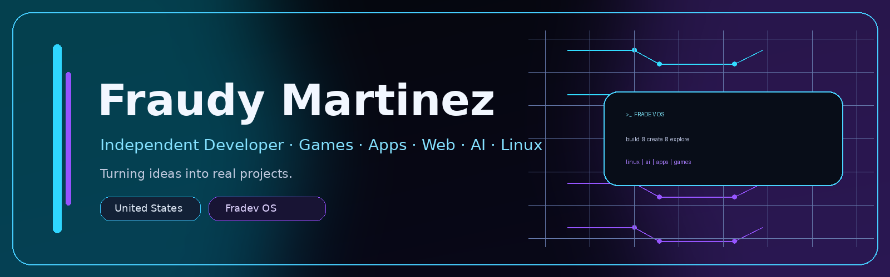

  

  
  
  
  

---

## 👋 About me / Sobre mí

**EN** — I'm **Fraudy Martinez**, an independent developer turning original ideas into games, applications, web tools, Linux projects and AI-powered experiences. I take every project from concept to release — design, code and polish included.

**ES** — Soy **Fraudy Martinez**, desarrollador independiente que convierte ideas originales en juegos, aplicaciones, herramientas web, proyectos Linux y experiencias con IA. Llevo cada proyecto del concepto a la publicación: diseño, código y pulido incluidos.

---

## ⭐ Featured project / Proyecto destacado — Fradev OS

> **Fradev OS 1.0 Stable 2** — a Debian 13-based Linux desktop OS built for development, productivity, compatibility, gaming and local AI assistance with **Fradev AI**.
>
> **ES** — Sistema operativo Linux de escritorio basado en **Debian 13**, pensado para desarrollo, productividad, compatibilidad, juegos y asistencia local con **Fradev AI**.

  
  
  

---

## 🧩 Projects / Proyectos

<table>
<tr>
<td width="50%" valign="top">

### 🎮 Fraudio
A 2D platformer game, designed and built from scratch.
Juego de plataformas 2D, diseñado y construido desde cero.

[**Repository**](https://github.com/YottoMtnz/Fraudio) · [**Website**](https://yottomtnz.github.io/Fraudio/)

</td>
<td width="50%" valign="top">

### 🌎 Juan Sin Visa
A 2D action-adventure platformer with story-driven gameplay.
Juego de plataformas 2D de acción y aventura con narrativa.

[**Repository**](https://github.com/YottoMtnz/JuanSinVisa) · [**Website**](https://yottomtnz.github.io/JuanSinVisa/)

</td>
</tr>
<tr>
<td width="50%" valign="top">

### 🎵 F.Crack Player
A local audio player for Windows — fast, simple, no nonsense.
Reproductor de audio local para Windows: rápido, simple y directo.

[**Repository**](https://github.com/YottoMtnz/FCrack_Audio_Player) · [**Website**](https://yottomtnz.github.io/FCrack_Audio_Player/)

</td>
<td width="50%" valign="top">

### 🌊 Onda Music
A personal web music player with JSON playlists and Media Session support.
Reproductor web personal con playlists JSON y soporte de Media Session.

[**Repository**](https://github.com/YottoMtnz/ondaplayer) · [**Website**](https://yottomtnz.github.io/ondaplayer/)

</td>
</tr>
</table>

---

## 🛠️ Tech stack / Tecnologías

**Languages / Lenguajes**

  
  
  
  

**Platforms & tools / Plataformas y herramientas**

  
  
  
  
  

---

## 📊 GitHub stats / Estadísticas

  
  

---

## 📫 Connect / Contacto

- 🌐 **Fradev OS** — [website](https://yottomtnz.github.io/fradevosupdate/) · [repository](https://github.com/YottoMtnz/fradevosupdate)
- 💻 **GitHub** — [@YottoMtnz](https://github.com/YottoMtnz)

---

  <strong>© 2026 Fraudy Martinez</strong> · <em>Turning ideas into real projects.</em>

